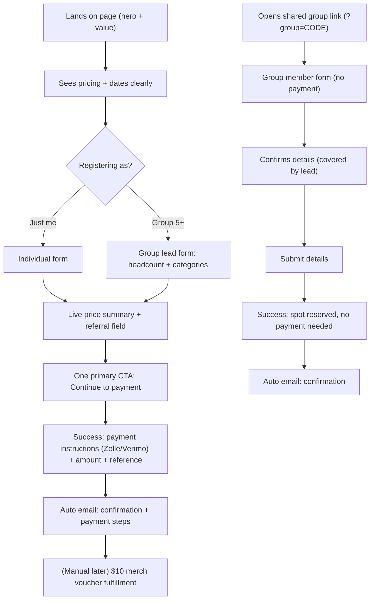
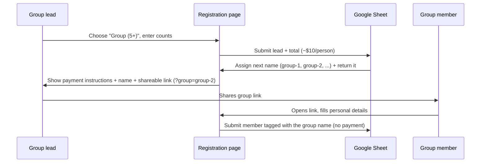

# OMC 2026 — Registration Customer Journey

This document describes the end-to-end experience for someone registering for OMC
2026, across all three paths (individual, group lead, group member), plus the
referral and payment mechanics. It is the human-centered reference that the
`omc-registration.html` form and `google-apps-script.gs` backend implement.

---

## 1. Who is registering? (three paths)

| Path | Who | Pays? | Key fields |
|------|-----|-------|-----------|
| Individual | A single attendee | Yes (their own ticket) | Personal details, category, package |
| Group lead | Organiser of 5+ people | Yes (whole group, −$10/person) | Headcount per category (name auto-assigned) |
| Group member | Someone given a group link | No (lead already paid) | Personal details, dietary only |

The path is chosen at the very top of the form so each person only ever sees the
fields relevant to them.

---

## 2. Journey map

---

## 3. Stage-by-stage experience

### Stage 1 — Arrive & understand
- Hero communicates the event and value ("Filled to Overflow").
- Pricing is transparent up front: the dated price table (Student / Professional ×
  Early bird / Regular / without accommodation & food) and the registration window
  (Early bird Jun 22 – Jul 12, Regular Jul 12 – Aug 20).
- Goal: the visitor understands what it costs *before* committing to fill anything.

### Stage 2 — Choose path
- A simple "I'm registering as…" choice: **Just me** or **A group (5+)**.
- If the visitor arrived via a group link (`?group=CODE`), this step is skipped and
  they go straight into the **group member** form.
- Goal: one decision, no irrelevant fields.

### Stage 3 — Fill details
- **Individual:** personal details → category (Student/Professional) → package
  (full vs without accommodation & food) → optional dietary/notes → referral.
- **Group lead:** how many Students and Professionals → optional
  dietary/notes for self → referral. The lead does not enter every member's name;
  members do that themselves later.
- **Group member:** personal details + dietary only. No pricing, no payment — their
  seat is already paid by the lead.
- Optional **"Referred by"** field (name + email): captures who referred them so both
  people can later receive a $10 merchandise voucher (handled manually).

### Stage 4 — Review & price summary
- A live "You'll pay $X" summary updates as choices change.
  - Individual: ticket price for the current period.
  - Group lead: sum of all members' tickets, each minus $10.
  - Group member: shows "Covered by your group — nothing to pay."
- Goal: no surprises at the payment step.

### Stage 5 — Submit (one clear CTA)
- A single primary button:
  - Individual / lead: **"Continue to payment"**
  - Member: **"Reserve my spot"**
- Validation guards required fields (name, email, terms) before submit.

### Stage 6 — Payment handoff (the destination)
- **rev1 (now):** success screen becomes a payment-instructions screen:
  - Amount due (clearly restated).
  - Zelle / Venmo handle(s).
  - A payment **reference** to include (registrant name + group code).
  - Reassurance: "We'll confirm your payment within X days."
- **Group member:** success screen confirms the spot is reserved, no payment needed.
- **rev2 (later):** the instructions block is replaced by a PayPal button / checkout,
  with the email receipt retained.

### Stage 7 — Confirmation & follow-up
- An automatic email is sent (confirmation + payment steps for payers, confirmation
  only for members). This replaces today's static "a confirmation has been sent"
  claim with a real email.
- Referral vouchers ($10 merch, up to 2 per person) are fulfilled manually from the
  Google Sheet.

---

## 4. Group discount mechanics (hybrid flow)

- Minimum group size: **5** (the lead counts as one).
- Discount: **−$10 per person**.
- Lead pays the full group total in one transaction; members pay nothing.
- The lead does **not** type a group name. The Apps Script assigns the next
  sequential name (`group-1`, `group-2`, ...) using a counter in Script
  Properties, and returns it so the page can show it and build the share link.
  The lead also receives the name + link by email (a fallback if the browser
  can't read the response).
- Seat-count reconciliation (did all members register?) is done manually in the Sheet.

---

## 5. Referral mechanics

- Optional **"Referred by (name + email)"** field on every registration.
- Both the referrer and the referred person receive a **$10 merchandise voucher**.
- Each person may refer **up to two** people.
- This does **not** discount the ticket price.
- In rev1, the 2-referral limit and voucher delivery are handled manually from the
  Sheet (no automated enforcement).

---

## 6. Data captured (Google Sheet columns)

In addition to today's fields, the Sheet will record:
- `registrationType` (individual / group-lead / group-member)
- `groupCode`, `groupSize`
- `amountDue`
- `referredByName`, `referredByEmail`

---

## 7. Revision roadmap

- **rev1:** Paths + referral + group discount + Zelle/Venmo payment instructions on
  the success page and via auto-email.
- **rev2:** PayPal payment integration on the post-registration step, email receipt
  retained.

---

## 8. Design principles checklist

- One decision at a time (path chosen before fields shown).
- Pricing transparency before commitment.
- A single primary CTA per screen, always pointing toward payment.
- Payment treated as the journey's destination, with amount + reference made obvious.
- Mobile-friendly, accessible, with reassurance/trust cues at the payment step.
